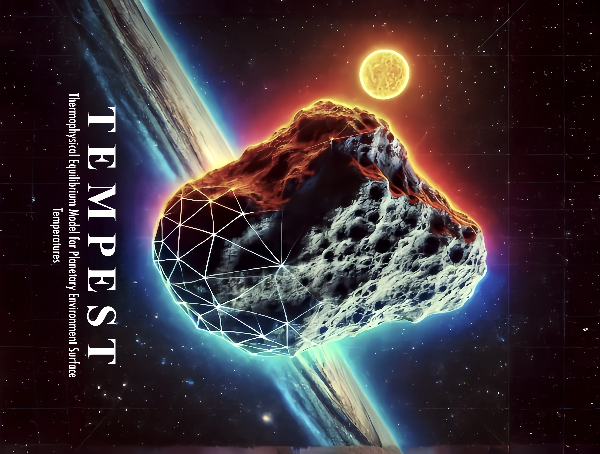

# Thermophysical Body Model Simulation Script
This Python script simulates diurnal temperature variations of a solar system body based on a given shape model. Initially designed for ESAs Comet Interceptor Mission planning as part of my research at the University of Oxford, it's adaptable for asteroids and other planetary bodies like Enceladus' surface fractures. As of 23 September 2024 it is stable and a range of test shape models converge well, but it is still under development to improve ease of use, computation speed, and validity in a wider range of parameter spaces. 

## Features
- Simulates temperature variations considering material and model properties.
- Calculates insolation and temperature arrays, iterating until model convergence.
- Visualises results and saves for further analysis.
- SI units are standard, exceptions are clearly stated.

## Requirements
- Python 3.x
- NumPy
- Matplotlib
- PyVista
- VTK
- Pandas
- Numba
- JobLib
- numpy-stl
- tqdm
- scipy
- seaborn (optional)
- scikit-learn (optional)
- STL file of the body shape in ASCII format.

## Usage
1. Ensure all dependencies are installed.
2. Place the shape model file in the same directory as the script.
3. Run the script with Python: `python thermophysical_body_model.py`

## Known issues and limitations
Please carefully read header notes in thermophysical_body_model.py for known bugs and limitations.

## Getting Started
The script begins by reading the provided shape model, setting up material and model parameters, and iterates through calculations until convergence is reached. Detailed steps and function descriptions are provided within the script.

Any easy way to convert a shape model that is in .stl (not ASCII), .obj or other format is in Blender.

## Contribution
Feel free to fork the project for custom enhancements or issue tracking on GitHub: https://github.com/duncanLyster/comet_nucleus_model

## Author
Duncan Lyster | Started: 15 Feb 2024

With contributions from: Joe Penn, Maisie Rashman, and Bea Chikani

## Licence
This project is open-source and available under the MIT License - see the License.md file for details.
