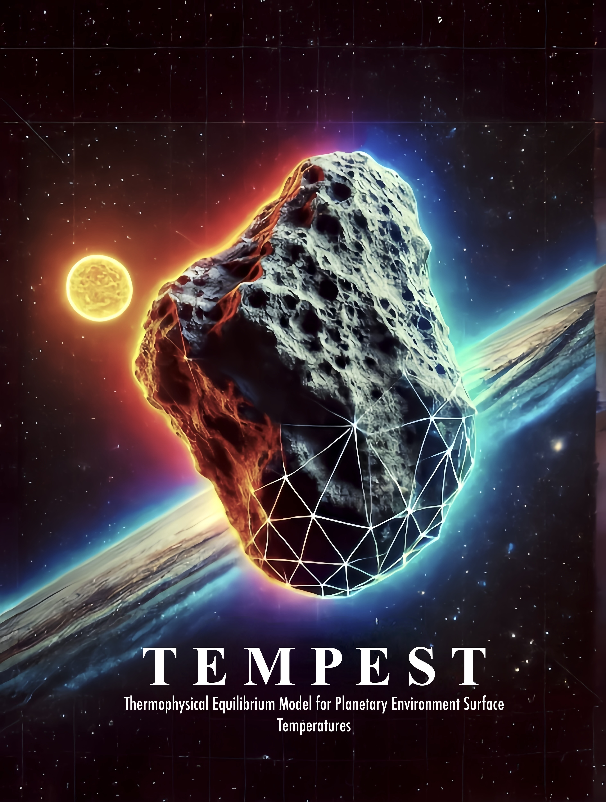

# Thermophysical Body Model Simulation Script
This Python script simulates diurnal temperature variations of a solar system body based on a given shape model. Initially designed for ESAs Comet Interceptor Mission planning as part of my research at the University of Oxford, it's adaptable for asteroids and other planetary bodies like Enceladus' surface fractures. As of 14 November 2024 it is stable and a range of test shape models converge well, but it is still under development to improve ease of use, computation speed, and validity in a wider range of parameter spaces. 

## Features
- Simulates temperature variations considering material and model properties.
- Calculates insolation and temperature arrays, iterating until model convergence.
- Visualises results and saves for further analysis.
- SI units are standard, exceptions are clearly stated.

## How to Get Started
1. Download this repository as a .zip file by clicking on the `<>Code` button above. Expand the .zip. 
2. Open a terminal window and navigate to the TEMPEST folder you have downloaded.
3. Ensure you have Python 3 installed and selected (you can download at `https://www.python.org/` then check this using `python --version`) 
4. Ensure all dependencies are installed `pip install -r requirements.txt`
5. Run the script with Python: `python tempest.py --config data/config/example_config.yaml`

TEMPEST will then proceed by:
1. Calculating insolation and temperature arrays.
2. Iterating through the model until convergence is reached.
3. Saving and visualising results for further analysis.

To adapt the model to your own purposes start by updating settings including material, model parameters and shape model selection in data/config/example_config.yaml

Tip: If your shape model is not in ASCII .stl format, you can use Blender to convert it.

## Requirements
Ensure the following Python packages are installed:

- numpy
- matplotlib
- pandas
- numba
- joblib
- numpy-stl
- tqdm
- scipy
- seaborn
- scikit-learn
- pyvista
- vtk
- pyyaml
- h5py

Additionally, ensure you have:
- Python 3.x installed (you can check this using `python --version`)
- An STL file of the body shape in ASCII format

## Contribution
Feel free to fork the project for custom enhancements or issue tracking on GitHub: https://github.com/duncanLyster/comet_nucleus_model

## Author and Acknowledgements
Duncan Lyster | Started: 15 Feb 2024

With contributions from: Joe Penn, Maisie Rashman, and Bea Chikani

## Licence
This project is open-source and available under the MIT License - see the License.md file for details.
