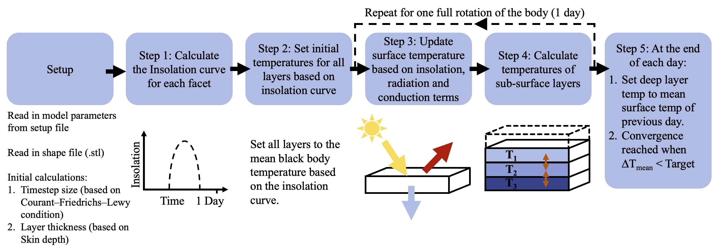

# TEMPEST v1.0.0 - Thermophysical Body Model
This Python script simulates diurnal temperature variations of a solar system body based on a given shape model. Initially designed for ESAs Comet Interceptor Mission planning as part of my research at the University of Oxford, it's adaptable for asteroids and other planetary bodies like Enceladus' surface fractures. As of 17 November 2025 it is stable and a range of test shape models converge well, but it is still under development to improve ease of use, computation speed, and validity in a wider range of parameter spaces. 

## Features
- Simulates temperature variations considering material and model properties.
- Calculates insolation and temperature arrays for each model facet, iterating until model convergence.
- Visualises results and saves for further analysis.
- SI units are standard, exceptions are clearly stated.

## How to Get Started
You can watch this video which takes you through from download to running TEMPEST on your own computer: https://youtu.be/0_YJEAbp2vQ

1. Download this repository as a .zip file by clicking on the V1.0.0 "Tagged Release". Download and expand the .zip. 
2. Open a terminal window and navigate to the TEMPEST folder you have downloaded (this may trigger a package update that could take a few minutes)
3. Ensure you have Python 3.x installed and selected (you can download at https://www.python.org/ then check this using `python --version`) 
4. Ensure all dependencies are installed `pip install -r requirements.txt`
5. Run the script with Python: `python tempest.py --config data/config/example_config.yaml`

TEMPEST will then:
1. Calculate insolation and temperature arrays.
2. Iterate through the model until convergence is reached.
3. Visualise results with the option of saving them for further analysis.

To adapt the model to your own purposes start by updating settings including material, model parameters and shape model selection in data/config/example_config.yaml

Tips:
Use and Integrated Development Environment (IDE) for example VS Code (download at https://code.visualstudio.com/) for editing your config.yaml file, and to inspect/edit any of the source code. 
If your shape model is not in ASCII .stl format, you can use Blender (download at https://www.blender.org/) to convert it.

## Model Architecture
See below flowchart from my 2024 EPSC poster presentation (https://presentations.copernicus.org/EPSC2024/EPSC2024-1121_presentation.pdf) which gives more detail on the model architecture. 

## Contribution
Feel free to fork the project for custom enhancements or issue tracking on GitHub: https://github.com/duncanLyster/TEMPEST

## Author and Acknowledgements
Duncan Lyster | Started: 15 Feb 2024
With contributions from: Joe Penn, Maisie Rashman, and Bea Chikani

## Citation and Attribution

If you use TEMPEST in any academic publication, presentation, or public derivative work, please cite:

> Lyster, D., Howett, C., & Penn, J. (2025).  
> *TEMPEST: A Modular Thermophysical Model for Airless Bodies with Support for Surface Roughness and Non-Periodic Heating.*  
> Submitted to EPSC-DPS Joint Meeting 2025.

Please also include the copyright notice and license file in any redistributed form.

## Licence

This project is open-source under a modified MIT License that requires attribution in academic and public use.  
See the [LICENSE](LICENSE) file for full terms.
